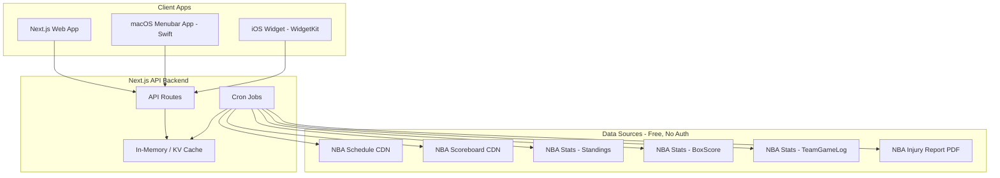

# Next Ball -- Cleveland Cavaliers Upcoming Game App

## Architecture Overview

Three client apps share a single **Next.js API backend** that fetches, caches, and serves aggregated game data. The backend runs as a Next.js app deployed to Vercel (or similar), serving both the web UI and a REST/JSON API consumed by the native clients.



## Data Sources (All Free, No API Key Required)

| Data Need                                         | Source           | Endpoint                                                                  |
| ------------------------------------------------- | ---------------- | ------------------------------------------------------------------------- |
| Schedule, date/time, opponent, arena, broadcasts  | NBA CDN          | `cdn.nba.com/static/json/staticData/scheduleLeagueV2.json`                |
| Today's scoreboard (live game status)             | NBA CDN          | `cdn.nba.com/static/json/liveData/scoreboard/todaysScoreboard_00.json`    |
| Conference/league standings                       | NBA Stats        | `stats.nba.com/stats/leaguestandingsv3`                                   |
| Box scores (opponent last 3 games + H2H matchups) | NBA Stats        | `stats.nba.com/stats/boxscoretraditionalv3`                               |
| Team game log (find recent games)                 | NBA Stats        | `stats.nba.com/stats/teamgamelog`                                         |
| Injury reports                                    | NBA Official PDF | `ak-static.cms.nba.com/referee/injury/Injury-Report_YYYY-MM-DD_...pdf`    |
| Starting lineups (game-day)                       | NBA Stats        | `stats.nba.com/stats/boxscoretraditionalv3` (once tip-off data available) |

**Note on stats.nba.com**: These endpoints require a `Referer: https://www.nba.com` header and a browser-like `User-Agent`, but no API key. The `nba_api` Python patterns document the exact headers needed; we will replicate them in our Node.js fetch calls.

**Note on injury reports**: The NBA publishes injury reports as PDFs. We will parse these using a PDF-to-text library. The report URL pattern is predictable by date.

**Note on starting lineups**: True "starting lineups" are confirmed only at tip-off. Pre-game, we show the projected/expected starters from the injury report status (players listed as "Available" or "Probable") combined with recent starting lineup data from box scores.

## Caching and Refresh Strategy

Since games are never less than 24 hours apart, we use a tiered cron strategy:

- **Schedule + Standings**: Refresh every **6 hours**. Changes are rare and slow-moving.
- **Opponent last 3 games + H2H matchups**: Refresh every **6 hours** (or when the "next game" changes). These are historical and only change after new games are played.
- **Injury report**:
  - Non-game-day: Refresh every **6 hours**.
  - Game-day (detected automatically): Refresh every **30 minutes** from 10am ET to tip-off (NBA mandates updates by 1pm ET game-day).
- **Scoreboard/live data**: Only fetched on game-day, every **2 minutes** during game window.
- **Starting lineups**: Fetched once ~15 min before tip-off and again shortly after tip-off from box score data.

All data is cached in **Vercel KV** (or Redis) so API responses to clients are instant. The cron jobs are the only processes hitting NBA endpoints.

**Cost estimate**: ~50-100 NBA API calls per game day, ~20 calls on non-game days. Well within any rate limits for these free endpoints.

## App 1: Next.js Web App (Build First)

This is the foundation -- it contains both the backend API and the web frontend.

**Tech stack**:

- **Next.js 15** (App Router) with TypeScript
- **Tailwind CSS** for styling
- **Vercel KV** (or Upstash Redis) for caching
- **Vercel Cron** for scheduled data fetching
- Deployed to **Vercel** free tier

**Pages**:

- Single-page app showing the next Cavaliers game with all required data sections
- Dark theme with Cavaliers branding (wine #6F263D and gold #FFB81C)

**API routes** (consumed by all clients):

- `GET /api/next-game` -- returns the complete aggregated "next game" payload:

```typescript
interface NextGameResponse {
  game: {
    gameId: string;
    dateTime: string; // ISO 8601
    opponent: TeamInfo;
    location: string;
    isHome: boolean;
    broadcasts: Broadcast[];
  };
  standings: {
    cavaliers: StandingsEntry;
    opponent: StandingsEntry;
  };
  injuries: {
    cavaliers: InjuryEntry[];
    opponent: InjuryEntry[];
  };
  projectedLineups: {
    cavaliers: Player[];
    opponent: Player[];
  };
  opponentRecentGames: GameSummary[]; // last 3
  headToHead: GameSummary[]; // last 3 matchups
  lastUpdated: string;
}
```

**Key source files**:

- `src/lib/nba/schedule.ts` -- parse schedule JSON, find next CLE game
- `src/lib/nba/standings.ts` -- fetch and parse standings
- `src/lib/nba/injuries.ts` -- fetch and parse injury report PDFs
- `src/lib/nba/gamelog.ts` -- fetch team game logs, box scores
- `src/lib/nba/lineups.ts` -- derive projected lineups from box scores + injuries
- `src/lib/cache.ts` -- KV cache read/write helpers
- `src/app/api/next-game/route.ts` -- the unified API endpoint
- `src/app/api/cron/refresh/route.ts` -- cron handler for data refresh
- `src/app/page.tsx` -- the main web UI

## App 2: macOS Menubar App (Swift)

A lightweight native macOS app that sits in the menu bar showing the next game countdown and details in a popover.

**Tech stack**:

- **Swift + SwiftUI** with `MenuBarExtra` (macOS 13+)
- Fetches from the deployed Next.js `/api/next-game` endpoint
- Polls every 30 min (or 5 min on game day)

**Features**:

- Menu bar icon shows Cavaliers logo + countdown ("3h 22m") or "LIVE"
- Click to expand a popover with full game details
- Native macOS notifications for game-day reminders

## App 3: iOS App + Widget (Swift)

A minimal iOS app with a WidgetKit home screen widget.

**Tech stack**:

- **Swift + SwiftUI** for the app
- **WidgetKit** for home screen widgets (small, medium, large)
- Shared Swift Package for models and API client (reused with menubar app)

**Features**:

- Small widget: opponent logo, date/time, location
- Medium widget: adds broadcast info, standings snippet
- Large widget: full detail including injuries
- App provides full detail view similar to web app

**Code sharing** (macOS + iOS): A local Swift Package (`NextBallKit`) containing:

- API client (`NextBallAPI.swift`)
- Shared models (`Models.swift`)
- Date/formatting utilities

## Recommended Build Order

1. **Next.js Web App** -- build the backend API + web UI first. This validates all data sources, caching logic, and provides the API that native apps will consume.
2. **macOS Menubar App** -- quick to build once the API exists; good for daily use during development.
3. **iOS App + Widget** -- most complex native client; build last with the shared Swift package.

## Project Structure

```
next-ball/
  web/                          # Next.js app (web + API backend)
    src/
      app/
        api/
          next-game/route.ts
          cron/refresh/route.ts
        page.tsx
        layout.tsx
      lib/
        nba/
          schedule.ts
          standings.ts
          injuries.ts
          gamelog.ts
          lineups.ts
          types.ts
        cache.ts
      components/
        GameCard.tsx
        StandingsTable.tsx
        InjuryReport.tsx
        Starters.tsx, StartingLineupSection.tsx
        BroadcastInfo.tsx
        RecentGames.tsx
    tailwind.config.ts
    package.json
  apple/                        # Xcode workspace
    NextBallKit/                # Shared Swift Package
      Sources/NextBallKit/
        API.swift
        Models.swift
    NextBallMac/                # macOS menubar app target
    NextBalliOS/                # iOS app target
    NextBallWidget/             # WidgetKit extension
```
